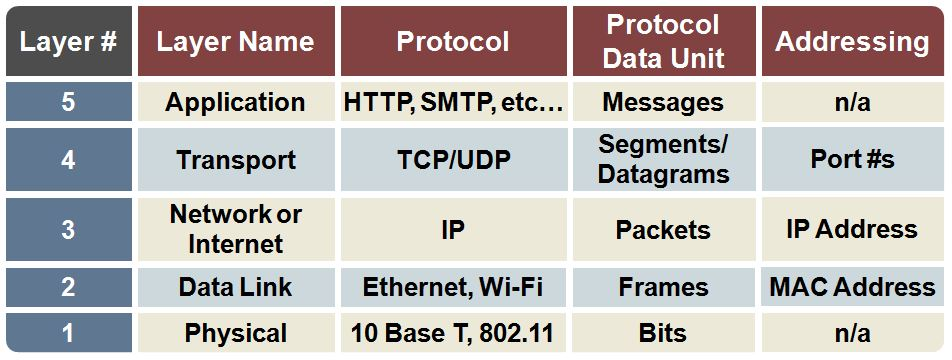

# The TCP/IP Five-Layer Network Model

## 1. Physical Layer
Represent physical devices that interconnects computers. Includes specifications for networking cables and connectors that join devices together. Also defines how signals are sent over these connections. Sends and receives signals on the phsical wire or antenna to transmit bits.

## 2. Data Link Layer
Also called as `Network interface` or `Network access layer`. It is responsible for defining a common way of interpreting the signals sent by physical layer so network devices can communicate. Although lots of protocols available, the most common is `Ethernet` (Although wireless technologies becoming more and more popular). 

Data bits are encoded, decoded and organized in the data link layer, before they are transported as frames between two adjacent nodes on the same `lan` or `wan`.

## 3. Network Layer
Also called as `Internet Layer`. Allows different networks to communicate with each other through devices known as `router`s. A collection of networks connected together through routers, the most famous of these being the `Internet`.

Data link layer is reponsible for transferring data across a single link, network layer's responsibility is to get the data delivered across a collection of networks.

Between browser and server, network layer help to communicate. The most widely used protocol for network layer is calld `IP` or `Internet protocol`.

## 4. Transport Layer
A single node on the network can run multiple client applications like mail client and web browser. Also a node can run multiple server applications like mail server and web server. 

Transport layer sorts out which client and server programs are supposed to get data. 

The most common used protocol for transport layer is called `TCP` or `Transmission control protocol`. Another popular protocol for transport layer is called `UDP` or `User datagram protocol`. But both protocols use `IP` protocol. This is why it's called `TCP/IP` meaning `TCP over IP`. 

UDP speeds up communication by not requiring `handshake`. At the other hand, TCP has mechanisms to ensure that data is reliably delivered. 

So, at the transport layer, TCP or UDP, is responsible for the data gets to the right applications.

## 5. Applicatio Layer

---
References

1. Networking - The TCPIP Five Layer Network Model https://www.youtube.com/watch?v=6c_BbiBiwkM

2. UDP vs TCP https://www.cloudflare.com/learning/ddos/glossary/user-datagram-protocol-udp/